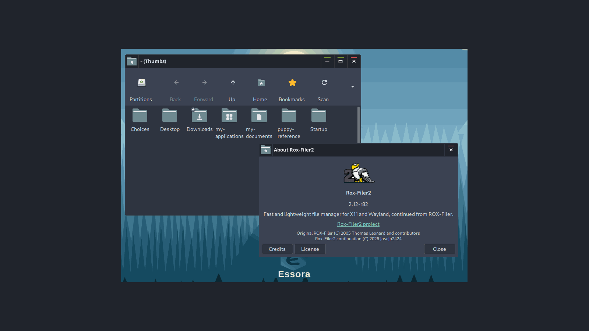

<p align="center">
  
</p>

<h1 align="center">Rox-Filer2</h1>

<p align="center">
  Fast and lightweight GTK3 file manager and desktop for X11, XLibre and native Wayland.
</p>

<p align="center">
  The classic ROX-Filer workflow, modernized for current Linux desktops.
</p>

---

<p align="center">
  
</p>

## About Rox-Filer2

**Rox-Filer2** is a modern continuation of the classic **ROX-Filer** file
manager and desktop originally created by **Thomas Leonard** for the ROX
Desktop.

The project keeps the speed, simplicity and direct workflow of ROX-Filer while
modernizing the old GTK2/X11-only implementation for current GTK3 systems.

Rox-Filer2 now supports:

- X11
- XLibre
- Native Wayland
- GTK3
- A complete desktop mode
- System MIME icons and XDG application associations

Rox-Filer2 has strong roots in Puppy Linux and remains especially useful
there, but it is not Puppy-specific. The project is intended to be usable by
any Linux distribution that wants a fast, lightweight GTK3 file manager and
desktop for X11/XLibre or Wayland.

The visible project name is **Rox-Filer2**.

For compatibility with existing ROX/Puppy Linux installations, the traditional
AppDir and configuration paths are intentionally preserved:

```text
/usr/local/apps/Rox-Filer
~/.config/rox.sourceforge.net/ROX-Filer
```

Other distributions are free to integrate Rox-Filer2 into their normal package
layout while keeping the expected runtime files and launchers available.

## X11 and Wayland

Rox-Filer2 can run natively on both X11/XLibre and Wayland.

Normal filer windows use the active GTK3 GDK backend.

The desktop has separate display backends:

```text
desktop-x11.c
desktop-wayland.c
```

Common desktop behaviour remains shared in:

```text
desktop.c
```

On Wayland, Rox-Filer2 uses **GTK Layer Shell** to create a real desktop
surface.

The Wayland desktop has been tested with **Labwc/wlroots** and supports:

- Desktop icons
- Wallpaper
- Files and folders
- `.desktop` launchers
- Drive and partition icons
- Trash
- Context menus
- Drag and drop
- Desktop refresh
- Icon organization

The same Rox-Filer2 source supports both X11 and Wayland.

## New desktop model

The old ROX pinboard system is no longer used as the normal desktop.

Rox-Filer2 now uses one unified desktop command:

```sh
rox --desktop
```

The old named pinboard/session model was removed.

This simplified the desktop code and made it possible to add a native Wayland
backend without duplicating the complete desktop implementation.

Available launchers are:

```text
rox
rox-x11
rox-wayland
```

`rox` automatically selects the correct backend for the current session.

`rox-x11` forces X11.

`rox-wayland` forces native Wayland.

## Main features

- Fast GTK3 file manager
- Classic ROX icon and detailed list views
- X11/XLibre support
- Native Wayland support
- Native Wayland desktop through Layer Shell
- Files and applications on `~/Desktop`
- Wallpaper manager
- Desktop application manager
- Drive and partition icons
- Freedesktop Trash
- GTK/Freedesktop system MIME icons
- XDG/GIO default applications
- Cut, Copy and Paste in contextual menus
- Copy / Move / Link drag-and-drop chooser
- Wayland cross-window drag and drop
- Fast rsync-assisted copy and move operations
- Improved file-operation dialogs
- Back and Forward navigation
- Open With and default application support
- Terminal and script execution
- File templates
- ROX File Search
- Paired filer windows
- Multilingual interface

## System MIME icons

Rox-Filer2 no longer depends on the old private ROX MIME icon system for normal
file icons.

MIME types are detected through the system and icons are requested from the
active GTK/Freedesktop icon theme.

Examples include:

```text
text-plain
text-x-generic
image-png
application-x-shellscript
application-zip
inode/directory
```

This means Rox-Filer2 follows the icon theme selected by the user, such as
Papirus, Adwaita, PMaterial or another Freedesktop-compatible theme.

Puppy-specific formats can still use their own MIME icons by installing them in
the standard `hicolor` icon theme.

## XDG application associations

Default applications are handled through the standard XDG/GIO system.

The main user configuration is:

```text
~/.config/mimeapps.list
```

Applications selected as default in another XDG-compatible file manager can
also be recognized by Rox-Filer2.

The old ROX-specific MIME association directories are no longer used as the
normal source of default applications.

`Open With` and `Set Default Application` use modern `.desktop` files and
GIO/XDG information.

## Drag and drop

Rox-Filer2 keeps the traditional ROX drag-and-drop workflow.

When appropriate, dropping files can show:

```text
Copy
Move
Link (relative)
Link (absolute)
```

Wayland drag and drop is handled specially because the source and destination
may belong to different processes.

Rox-Filer2 can still show its Copy / Move / Link chooser instead of silently
falling back to a direct copy.

This works with normal files, scripts, directories, images, `.desktop` files
and other filesystem objects.

## Desktop refresh and icon organization

The desktop uses:

```text
~/Desktop
```

Files, folders and application launchers placed there appear on the desktop.

Running:

```sh
rox --desktop-refresh
```

or selecting **Refresh Desktop** refreshes the desktop and also reorganizes
icons on the desktop grid.

If an icon was left out of alignment or in the middle of the desktop, Refresh
Desktop places it back into the normal icon layout.

Icons can still be moved manually during normal use.

Drive icons keep their own reserved desktop area.

## Desktop wallpaper

Open the wallpaper manager with:

```sh
rox --desktop-wallpaper
```

It can select and apply wallpapers without restarting the complete desktop.

## Desktop applications

Open the desktop application manager with:

```sh
rox --desktop-apps
```

Applications can be added to or removed from `~/Desktop`.

## Drives and partitions

Rox-Filer2 can display and manage real storage devices.

Supported actions include:

- Open
- Mount
- Unmount
- Eject

Device icons come from the active system icon theme.

Examples:

```text
drive-harddisk
drive-harddisk-solidstate
drive-removable-media
media-flash
media-cdrw
drive-network
```

<p align="center">
  
</p>

## Trash

Rox-Filer2 uses the standard Freedesktop Trash through GIO.

Normal Delete moves files to Trash.

Permanent deletion remains a separate action.

Typical Trash locations are:

```text
~/.local/share/Trash/files
~/.local/share/Trash/info
```

## Scripts and terminal

Rox-Filer2 includes improved script detection and terminal execution.

Supported shebang examples include:

```text
#!/bin/sh
#!/bin/bash
#!/usr/bin/env python3
#!/usr/bin/env -S python3 -u
```

The shebang has priority over the filename extension.

When running a script in a terminal, Rox-Filer2 changes to the script directory
before execution.

## ROX File Search

Rox-Filer2 includes the native GTK3 search companion:

```text
rox-find
```

Examples:

```sh
rox-find /root
rox-find --name '*.svg' /usr/share
rox-find --content 'Rox-Filer2' /root/projects
```

## Quick start

Compile Rox-Filer2:

```sh
cd ROX-Filer
./AppRun --compile
```

Open a filer window:

```sh
rox .
```

Start the desktop:

```sh
rox --desktop
```

Force X11:

```sh
rox-x11 .
```

Force Wayland:

```sh
rox-wayland .
```

Refresh the desktop:

```sh
rox --desktop-refresh
```

Show command-line help:

```sh
rox --help
```

## Build requirements

Rox-Filer2 can be built and packaged by any Linux distribution with the normal
GTK3 development stack.

Typical development dependencies include:

- GTK3
- GLib / GObject
- GDK-Pixbuf
- Cairo
- libxml2
- X11 development files for the X11/XLibre backend
- SM / ICE
- `pkg-config`

For the native Wayland desktop, `gtk-layer-shell` is required at runtime.

Optional tools include:

- `rsync`
- `udisksctl`
- `gtk-update-icon-cache`
- A terminal emulator

Package names differ between Debian/Ubuntu/Puppy, Arch, Fedora, Slackware and
other distributions, so the repository documents libraries rather than
distribution-specific dependency package names.
## Compatibility

Rox-Filer2 keeps important historical paths so existing ROX and Puppy Linux
applications and user configurations continue to work:

```text
/usr/local/apps/Rox-Filer
~/.config/rox.sourceforge.net/ROX-Filer
```

Modern replacements include:

- `rox --desktop` instead of named pinboards
- XDG/GIO MIME associations
- GTK/Freedesktop system MIME icons
- Native Wayland support
- Layer Shell for the Wayland desktop

## Distribution integration

Rox-Filer2 is suitable for distribution packaging and is not tied to one Linux
base.

A distribution can use Rox-Filer2 as:

- A lightweight standalone file manager
- A GTK3 file manager for X11/XLibre
- A native Wayland file manager
- A desktop manager on supported X11 or Layer Shell Wayland sessions
- A Puppy Linux ROX-Filer replacement or continuation

The project keeps compatibility where it matters, while using standard GTK,
GIO, XDG and Freedesktop behaviour so it can integrate cleanly outside Puppy
Linux as well.

## Credits

### Original ROX-Filer

ROX-Filer was originally created by **Thomas Leonard** for the ROX Desktop.

The work of the original ROX Desktop contributors remains credited and the
original copyright notices are preserved in the source.

### Rox-Filer2

- Original ROX-Filer author: **Thomas Leonard**
- Original ROX-Filer contributors: **ROX Desktop contributors**
- Rox-Filer2 continuation and development: **josejp2424**
- Rox-Filer2 project maintainer: **josejp2424**

## License

Rox-Filer2 is distributed under:

```text
GPL-3.0-or-later
```

See:

```text
LICENSE
```

Original ROX-Filer copyright, authorship and licensing notices remain
preserved.

---

<p align="center">
  <strong>Rox-Filer2</strong><br>
  Classic ROX simplicity for modern Linux desktops — GTK3, X11, XLibre and native Wayland.
</p>
