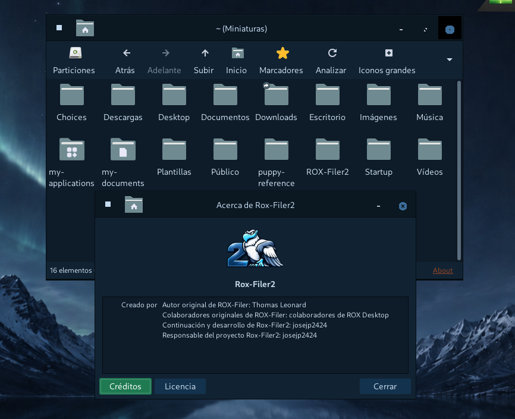
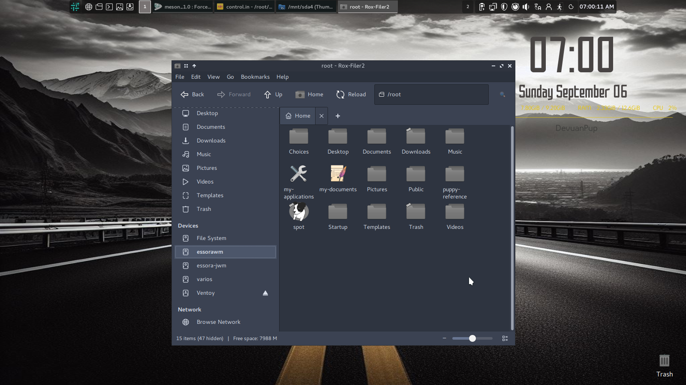
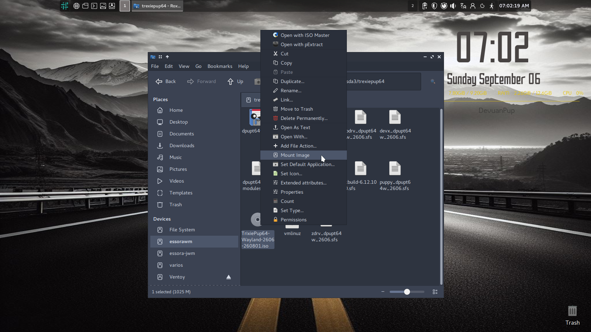

<p align="center">
  
</p>

<h1 align="center">Rox-Filer2</h1>

<p align="center">
  Fast and lightweight GTK3 file manager and desktop for X11, XLibre and native Wayland.
</p>

<p align="center">
  The classic ROX-Filer workflow, modernized for current Linux desktops.
</p>

---

<p align="center">
  
</p>

## About Rox-Filer2

**Rox-Filer2** is a modern continuation of the classic **ROX-Filer** file
manager and desktop originally created by **Thomas Leonard** for the ROX
Desktop.

The project keeps the speed, simplicity and direct workflow of ROX-Filer while
modernizing the old GTK2/X11-only implementation for current GTK3 systems.

Rox-Filer2 now supports:

- X11
- XLibre
- Native Wayland
- GTK3
- A complete desktop mode
- System MIME icons and XDG application associations

Rox-Filer2 has strong roots in Puppy Linux and remains especially useful
there, but it is not Puppy-specific. The project is intended to be usable by
any Linux distribution that wants a fast, lightweight GTK3 file manager and
desktop for X11/XLibre or Wayland.

The visible project name is **Rox-Filer2**.

For compatibility with existing ROX/Puppy Linux installations, the traditional
AppDir and configuration paths are intentionally preserved:

```text
/usr/local/apps/Rox-Filer
~/.config/rox.sourceforge.net/ROX-Filer
```

Other distributions are free to integrate Rox-Filer2 into their normal package
layout while keeping the expected runtime files and launchers available.

## X11 and Wayland

Rox-Filer2 can run natively on both X11/XLibre and Wayland.

Normal filer windows use the active GTK3 GDK backend.

The desktop has separate display backends:

```text
desktop-x11.c
desktop-wayland.c
```

Common desktop behaviour remains shared in:

```text
desktop.c
```

On Wayland, Rox-Filer2 uses **GTK Layer Shell** to create a real desktop
surface.

The Wayland desktop has been tested with **Labwc/wlroots** and supports:

- Desktop icons
- Wallpaper
- Files and folders
- `.desktop` launchers
- Drive and partition icons
- Trash
- Context menus
- Drag and drop
- Desktop refresh
- Icon organization

The same Rox-Filer2 source supports both X11 and Wayland.

## Classic and Modern interfaces

Rox-Filer2 keeps the traditional ROX interface while also providing an
optional **Modern** interface. Both interfaces use the same filer backend,
file operations, MIME handling, desktop code and configuration.

The interface can be selected from Rox-Filer2 options or forced for one
launch from the command line:

```sh
rox --classic
rox --modern
```

The Modern interface adds:

- Compact folder tabs
- A **Places** sidebar for Home and the standard XDG user directories
- A **Devices** section for filesystems, disks and removable media
- A **Network** section with SMB/CIFS browsing
- Back, Forward, Up, Home and Reload controls
- An editable location field
- Persistent window geometry and Modern session state

Folder tabs show a short folder name while the location field keeps the full
current path. Tabs are fully switchable: clicking a tab activates its saved path,
view and navigation history, and the `+` button/Ctrl+T create a usable new tab.

In **Options > Interface > Modern**, **New Rox-Filer2 instances** can be set to
**New Window** or **New Tab**. The tab setting also redirects ordinary
new-window navigation started from an existing Modern window (folder/bookmark and
toolbar actions) into a tab. Requests forwarded to the running Modern process use
the same preference. The explicit **New Window** menu command always remains a
real separate window.

<p align="center">
  
</p>

The Modern interface is optional; users who prefer the original ROX workflow
can continue to use Classic mode without changing the underlying file-manager
functionality.

For tiling or undecorated window managers such as BSPWM and SpectrWM, the
existing toolbar customizer also offers an optional **Close Window** control. It
closes only the current filer window. The same preference controls the matching
Modern navigation-bar close button.

## New desktop model

The old ROX pinboard system is no longer used as the normal desktop.

Rox-Filer2 now uses one unified desktop command:

```sh
rox --desktop
```

The old named pinboard/session model was removed.

This simplified the desktop code and made it possible to add a native Wayland
backend without duplicating the complete desktop implementation.

Available launchers are:

```text
rox
rox-x11
rox-wayland
```

`rox` automatically selects the correct backend for the current session.

`rox-x11` forces X11.

`rox-wayland` forces native Wayland.

## Main features

- Fast GTK3 file manager
- Classic ROX interface and optional Modern interface
- Modern tabs with Places, Devices and Network sidebar
- Native SMB/CIFS browsing through runtime-detected `libsmbclient` without a GVfs dependency; Rox-Filer2 still starts when the library is absent
- Built-in Image Mounter for ISO, SFS, SquashFS and raw IMG images
- X11/XLibre support
- Native Wayland support
- Native Wayland desktop through Layer Shell
- Files and applications on `~/Desktop`
- Wallpaper manager
- Desktop application manager
- Drive and partition icons
- Freedesktop Trash
- GTK/Freedesktop system MIME icons
- XDG/GIO default applications
- Cut, Copy and Paste in contextual menus
- Copy / Move / Link drag-and-drop chooser
- Wayland cross-window drag and drop
- Fast rsync-assisted copy and move operations
- Improved file-operation dialogs
- Back and Forward navigation
- Open With and default application support
- Optional video thumbnails using `ffmpeg`
- Audio preview on pointer hover using optional `mpv`
- Configurable browser command with `%u` URL substitution and system fallbacks
- Terminal and script execution
- File templates
- ROX File Search
- Paired filer windows
- Multilingual interface

## Optional media previews

Rox-Filer2 keeps media helpers optional. Video thumbnails can be enabled from
**Options > Thumbnails** and use `ffmpeg` when it is available. Audio hover
preview is enabled by default and uses `mpv`; moving the pointer away stops
only the preview process started by Rox-Filer2. Missing helpers never prevent
the filer from starting or opening files normally.

## System MIME icons

Rox-Filer2 no longer depends on the old private ROX MIME icon system for normal
file icons.

MIME types are detected through the system and icons are requested from the
active GTK/Freedesktop icon theme.

Examples include:

```text
text-plain
text-x-generic
image-png
application-x-shellscript
application-zip
inode/directory
```

This means Rox-Filer2 follows the icon theme selected by the user, such as
Papirus, Adwaita, PMaterial or another Freedesktop-compatible theme.

Puppy-specific formats can still use their own MIME icons by installing them in
the standard `hicolor` icon theme.

## XDG application associations

Default applications are handled through the standard XDG/GIO system.

The main user configuration is:

```text
~/.config/mimeapps.list
```

Applications selected as default in another XDG-compatible file manager can
also be recognized by Rox-Filer2.

The old ROX-specific MIME association directories are no longer used as the
normal source of default applications.

`Open With` and `Set Default Application` use modern `.desktop` files and
GIO/XDG information.

## Drag and drop

Rox-Filer2 keeps the traditional ROX drag-and-drop workflow.

When appropriate, dropping files can show:

```text
Copy
Move
Link (relative)
Link (absolute)
```

Wayland drag and drop is handled specially because the source and destination
may belong to different processes.

Rox-Filer2 can still show its Copy / Move / Link chooser instead of silently
falling back to a direct copy.

This works with normal files, scripts, directories, images, `.desktop` files
and other filesystem objects.

## Desktop refresh and icon organization

The desktop uses:

```text
~/Desktop
```

Files, folders and application launchers placed there appear on the desktop.

Running:

```sh
rox --desktop-refresh
```

or selecting **Refresh Desktop** refreshes the desktop and also reorganizes
icons on the desktop grid.

If an icon was left out of alignment or in the middle of the desktop, Refresh
Desktop places it back into the normal icon layout.

Icons can still be moved manually during normal use.

Drive icons keep their own reserved desktop area.

## Desktop wallpaper

Open the wallpaper manager with:

```sh
rox --desktop-wallpaper
```

It can select and apply wallpapers without restarting the complete desktop.

## Desktop applications

Open the desktop application manager with:

```sh
rox --desktop-apps
```

Applications can be added to or removed from `~/Desktop`.

## Desktop preferences

Open the native desktop preferences directly from a script, terminal or
launcher with:

```sh
rox --desktop-preferences
```

The drive-icon layout dialog is also scriptable:

```sh
rox --desktop-drive-icon-layout
```

For compatibility with the name suggested by Puppy scripts,
`--desktop-drive_icon_layout` is accepted as an alias. Applying a layout asks
the running ROX Desktop to reload its settings immediately.

## ROX-Filer settings

The normal ROX-Filer Options window is available from the fixed Settings
button at the far right of the filer toolbar. It can also be opened directly:

```sh
rox --config-rox
```

## Drives and partitions

Rox-Filer2 can display and manage real storage devices.

Supported actions include:

- Open
- Mount
- Unmount
- Eject

Mounted volumes show a small eject/unmount arrow directly in both the Classic
Partitions popover and the Modern Devices sidebar. The arrow doubles as the
mounted-state indicator and disappears automatically after a successful
unmount/eject, matching the quick action used by Rox-Filer2 desktop drive icons.

Options > Drives now also provides optional startup automount. **Mount local
drives automatically at startup** mounts eligible local disk partitions after
the first Rox-Filer2 window is ready. **Include removable drives** extends this
to USB, SD and similar removable storage. Both options are disabled by default;
network shares, phones/cameras, mounted images, optical media, encrypted
containers and system/technical partitions are excluded. The settings are
stored with the rest of Rox-Filer2 preferences in the standard XDG Options
file (`~/.config/rox.sourceforge.net/ROX-Filer/Options` by default; under Puppy
root this is `/root/.config/rox.sourceforge.net/ROX-Filer/Options`). No PMADAS
Startup helper or separate automount configuration is created.

When Rox-Filer2 is running as root (the usual Puppy model), drive mount and
unmount operations are performed directly. When it is running as a normal
user, Rox-Filer2 uses `pkexec` with its fixed package-owned
`/usr/lib/rox-filer2/rox-mount-helper`. The helper accepts only validated
block-device mount, unmount and eject operations; it does not execute shell
commands. A working polkit authentication agent is required for the graphical
password prompt.

Device icons come from the active system icon theme.

Examples:

```text
drive-harddisk
drive-harddisk-solidstate
drive-removable-media
media-flash
media-cdrw
drive-network
```

<p align="center">
  
</p>

## Image Mounter

Rox-Filer2 includes a native **Image Mounter** integrated into the file
context menu.

Supported image formats include:

```text
.iso
.sfs
.squashfs
.sqfs
.sqsh
.img
```

For supported files the context menu provides **Mount Image**. Mounted images
are opened directly in Rox-Filer2; in Modern mode the mounted filesystem is
opened in a new tab.

SquashFS-based SFS images and ISO images are mounted read-only. Raw `.img`
files are also supported: a filesystem image can be mounted directly, while
partitioned images can expose their contained partitions for mounting.

The Image Mounter does not depend on GVfs. Root sessions can use the normal
Linux loop/mount tools directly, while non-root systems can use `udisksctl`
when it is available.

Mounted images created by Rox-Filer2 are also published under **Mounted Images**
in the Classic Partitions popover and the Modern Devices sidebar. Rox-Filer2
uses its own Image Mounter runtime state for this list, so Puppy/system loop
devices that were not created by Rox-Filer2 remain hidden. Unmounting one of
these entries also detaches its loop device and removes it from both interfaces.

Menu icons come from the active system icon theme.

<p align="center">
  
</p>

## Trash and delete confirmations

Rox-Filer2 Options > File Operations now provides two independent safety switches:

- **Confirm before moving files to Trash**
- **Confirm before permanently deleting files**

Both are enabled by default. Classic and Modern use the same settings, so a user
can keep either confirmation, both, or neither.

## Trash

Rox-Filer2 uses the standard Freedesktop Trash through GIO.

Normal Delete moves files to Trash.

Permanent deletion remains a separate action.

Typical Trash locations are:

```text
~/.local/share/Trash/files
~/.local/share/Trash/info
```

## Scripts and terminal

Rox-Filer2 includes improved script detection and terminal execution.

Supported shebang examples include:

```text
#!/bin/sh
#!/bin/bash
#!/usr/bin/env python3
#!/usr/bin/env -S python3 -u
```

The shebang has priority over the filename extension.

When running a script in a terminal, Rox-Filer2 changes to the script directory
before execution.

## ROX File Search

Rox-Filer2 includes the native GTK3 search companion:

```text
rox-find
```

Examples:

```sh
rox-find /root
rox-find --name '*.svg' /usr/share
rox-find --content 'Rox-Filer2' /root/projects
```

## Quick start

The recommended build method is Meson:

```sh
meson setup build
meson compile -C build
```

This builds both executables in the build directory:

```text
build/ROX-Filer
build/rox-find
```

The Meson-built `build/ROX-Filer` executable can be run directly from the
build tree and automatically uses the source `ROX-Filer/` AppDir for its
runtime resources.

The historical ROX build remains available for compatibility:

```sh
cd ROX-Filer
./AppRun --compile-only
```

Run the freshly built file manager directly from the source tree:

```sh
./build/ROX-Filer .
```

After installation, the normal launcher remains:

```sh
rox .
```

Start the desktop:

```sh
rox --desktop
```

Force X11:

```sh
rox-x11 .
```

Force Wayland:

```sh
rox-wayland .
```

Refresh the desktop:

```sh
rox --desktop-refresh
```

Show command-line help:

```sh
rox --help
```

## Build requirements

Rox-Filer2 can be built and packaged by any Linux distribution with the normal
GTK3 development stack.

Typical development dependencies include:

- GTK3
- GLib / GObject
- GDK-Pixbuf
- Cairo
- libxml2
- X11 development files for the X11/XLibre backend
- SM / ICE
- `pkg-config`
- Meson 0.61 or newer
- Ninja

For the native Wayland desktop, `gtk-layer-shell` is required at runtime.

Optional/runtime integration tools include:

- `rsync`
- `pkexec` / polkit for drive mounting as a normal user
- `udisksctl` for the separate Image Mounter normal-user path
- `gtk-update-icon-cache`
- A terminal emulator

Package names differ between Debian/Ubuntu/Puppy, Arch, Fedora, Slackware and
other distributions, so the repository documents libraries rather than
distribution-specific dependency package names.

For Debian/Puppy packaging, `./build-package.sh` now uses Meson by default when
Meson and Ninja are available. Use `./build-package.sh --legacy-build` only when
the historical AppRun/autoconf path is specifically required.

### Native Arch Linux package

The source tree includes a native Arch package builder:

```sh
./build_arch.sh
```

It builds Rox-Filer2 with Meson, runtime-optional SMB support and automatic
portable-device support (`-Dportable_devices=auto`) and creates a native
Arch Linux `.pkg.tar.zst` package in:

```text
output/
```

The Arch development dependencies must already be installed before running the
builder.

### Native Void Linux / KLV package

The source tree also includes a native Void package builder:

```sh
./build_void.sh
```

It builds Rox-Filer2 with Meson, runtime-optional SMB support and automatic
portable-device support (`-Dportable_devices=auto`), creates a native
`.xbps` package in `output/`, and indexes that directory as a local XBPS
repository. The upstream release name is `2.13.0-8`; for XBPS the
builder maps it to the native package form `2.13.0_8`.

These native builders are separate from `build-package.sh`; they package the
same Rox-Filer2 source against the libraries of the distribution where the
build is performed.

Portable devices are optional at runtime. Rox-Filer2 can use simple-mtpfs or
jmtpfs for Android/MTP, gphoto2/gphotofs for PTP cameras, and ifuse plus the
libimobiledevice tools for iPhone/iPad. If none are installed, the file manager
still starts normally. Non-block mountpoints already present below `/media` are
shown in the drive UIs independently of those helpers.


### Samba folder sharing

Rox-Filer2 2.13 adds native Samba usershare management without ThunarX or XFCE.
Right-click one local folder and choose **Share Folder...** for the quick path, or
open **Samba > Shared Folders...** to see all local usershares and open, edit or
stop sharing them from one small manager window. The per-folder action is hidden
when Samba's `net` helper is unavailable. Rox-Filer2 never elevates itself for
this action; Samba's normal usershare permissions and `sambashare`-style group
configuration remain in control. `testparm` is used when available to honor
`usershare owner only` and `usershare allow guests`. The UI prefers the themed
`folder-publicshare` icon and, when available, adds a small `emblem-shared` to
folders already exported through usershare. Missing Samba tools never prevent
the file manager from starting.

## Compatibility

Rox-Filer2 keeps important historical paths so existing ROX and Puppy Linux
applications and user configurations continue to work:

```text
/usr/local/apps/Rox-Filer
~/.config/rox.sourceforge.net/ROX-Filer
```

Modern replacements include:

- `rox --desktop` instead of named pinboards
- XDG/GIO MIME associations
- GTK/Freedesktop system MIME icons
- Native Wayland support
- Layer Shell for the Wayland desktop

## Distribution integration

Rox-Filer2 is suitable for distribution packaging and is not tied to one Linux
base.

A distribution can use Rox-Filer2 as:

- A lightweight standalone file manager
- A GTK3 file manager for X11/XLibre
- A native Wayland file manager
- A desktop manager on supported X11 or Layer Shell Wayland sessions
- A Puppy Linux ROX-Filer replacement or continuation

The project keeps compatibility where it matters, while using standard GTK,
GIO, XDG and Freedesktop behaviour so it can integrate cleanly outside Puppy
Linux as well.

## Credits

### Original ROX-Filer

ROX-Filer was originally created by **Thomas Leonard** for the ROX Desktop.

The work of the original ROX Desktop contributors remains credited and the
original copyright notices are preserved in the source.

### Rox-Filer2

- Original ROX-Filer author: **Thomas Leonard**
- Original ROX-Filer contributors: **ROX Desktop contributors**
- Rox-Filer2 continuation and development: **josejp2424**
- Rox-Filer2 project maintainer: **josejp2424**

## License

Rox-Filer2 is distributed under:

```text
GPL-3.0-or-later
```

See:

```text
LICENSE
```

Original ROX-Filer copyright, authorship and licensing notices remain
preserved.

---

<p align="center">
  <strong>Rox-Filer2</strong><br>
  Classic ROX simplicity for modern Linux desktops — GTK3, X11, XLibre and native Wayland.
</p>
